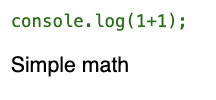

# Components

📖 **Recommended reading**: [React.dev - Your First Component](https://react.dev/learn/your-first-component)

React components allow you to modularize the functionality of your application. This allows the underlying code to directly represent the components that a user interacts with. It also enables code reuse as common application components often show up repeatedly.

## Rendering JSX

One of the primary purposes of a component is to generate the user interface. This is done with the JSX returned from a component. Whatever is returned, inserted into the component HTML element.

As a simple example, a JSX file containing a React component element named `Demo` would cause React to load the `Demo` component, get the JSX returned from the component, and insert the result into the place of the `Demo` element.

**JSX**

```jsx
<div>
  Component: <Demo />
</div>
```

Notice that `Demo` is not a valid HTML element. The transpiler will replace this tag with the resulting rendered HTML.

**React component**

```js
function Demo() {
  const who = 'world';
  return <b>Hello {who}</b>;
}
```

**Resulting HTML**

```html
<div>Component: <b>Hello world</b></div>
```

You should note that you can use JSX even without a function. A simple variable representing JSX will work anyplace you would otherwise provide a component.

```jsx
const hello = <div>Hello</div>;
const root = ReactDOM.createRoot(document.getElementById('root'));
root.render(hello);
```

**Resulting HTML**

```html
<div>Hello</div>
```

## Styling components

If you don't want to directly style your components with inline CSS rule sets, you can reference and external CSS file and then reference the rules in your JSX just like you would normally do with HTML. For example, if you had a CSS file named `index.css` with the following styles.

```css
div {
  font-family: sans-serif;
}

.code {
  color: green;
}
```

You could apply the style rules using importing the CSS. The styles will then apply as they would normally, with the exception that you need to use `className` attribute on an element instead of `class` because class is a keyword in JavaScript.

```jsx
import React from 'react';
import ReactDOM from 'react-dom/client';
import './index.css';

function App() {
  return (
    <div>
      <pre className="code">console.log(1+1);</pre>
      <p>Simple math</p>
    </div>
  );
}

const root = ReactDOM.createRoot(document.getElementById('root'));
root.render(<App />);
```

This results in the following.



## Child components

The JSX that a component returns may reference other components. This allows you to build up a complex tree of interrelated components. Consider the following application that has a header with navigational elements, main content, and a footer. The App component is the parent of all the other components.

#### index.jsx

```jsx
import React from 'react';
import ReactDOM from 'react-dom/client';
import './index.css';

function Header() {
  return (
    <nav className="app-bar">
      <Link label="home" />
      <Link label="users" />
      <Link label="about" />
    </nav>
  );
}

function Link(label) {
  return <div>{label.label}</div>;
}

function Content() {
  return <div className="content">Here is the content</div>;
}

function Footer() {
  return <div className="app-bar">Footer</div>;
}

function App() {
  return (
    <div className="app">
      <Header />

      <Content />

      <Footer />
    </div>
  );
}

const root = ReactDOM.createRoot(document.getElementById('root'));
root.render(<App />);
```

#### index.css

```css
.app {
  font-family: sans-serif;
}

.app-bar {
  display: flex;
  align-items: center;
  justify-content: center;
  background: #ddd;
}

.app-bar div {
  padding: 0.25em;
}

.content {
  margin: 1em;
}
```

This results in the following.


## Properties

React components also allow you to pass information to them in the form of element properties. The component receives the properties in its constructor and then can display them when it renders.

**JSX**

```jsx
<div>Component: <Demo who="Walke" /><div>
```

**React component**

```jsx
function Demo(props) {
  return <b>Hello {props.who}</b>;
}
```

## State

In addition to properties, a component can have internal state. Component state is created by calling the `React.useState` hook function. The `useState` function returns a variable that contains the current state and a function to update the state. The following example creates a state variable called `clicked` and toggles the click state in the `updateClicked` function that gets called when the paragraph text is clicked.

```jsx
function App() {
  const [clicked, updateClicked] = React.useState(false);

  function onClicked() {
    updateClicked(!clicked);
  }

  return <p onClick={onClicked}>clicked: {`${clicked}`}</p>;
}

const root = ReactDOM.createRoot(document.getElementById('root'));
root.render(<App />);
```

## Reactivity

A component's properties and state are used by the React framework to determine the reactivity of the interface. Reactivity controls how a component reacts to actions taken by the user or events that happen within the application. Whenever a component's state or properties change, the `render` function for the component and all of its dependent component `render` functions are called.

## ☑ Assignment

Create a fork of this [CodePen](https://codepen.io/leesjensen/pen/Yzvaver) and experiment.

Try the following:

1. Add a new property to the Demo component that provides the background color for the component.
2. Add another state variable that changes the color on a mouse over event.

_If your section of this course requires that you submit assignments for grading_: Submit your CodePen URL to the Canvas assignment.

### 🧧 Possible solution

If you get stuck here is a possible solution.

```jsx
function App() {
  return (
    <div>
      Function Style Component: <Demo who="function" initialColor="yellow" />
    </div>
  );
}

function Demo(props) {
  const [color, setColor] = React.useState(props.initialColor);
  const [outlook, setOutlook] = React.useState('beautiful');

  function changeOutlook() {
    setOutlook(outlook === 'exciting' ? 'beautiful' : 'exciting');
  }

  function changeColor() {
    var randomColor = Math.floor(Math.random() * 16777215).toString(16);
    setColor('#' + randomColor);
  }

  return (
    <div className="component" onMouseOver={changeColor} style={{ background: color }}>
      <p>
        Hello {outlook} {props.who}
      </p>
      <button onClick={changeOutlook}>change</button>
    </div>
  );
}

const root = ReactDOM.createRoot(document.getElementById('root'));
root.render(<App />);
```
