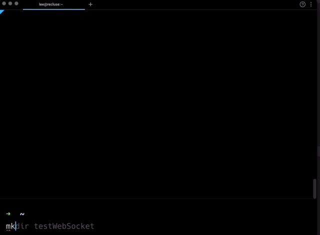

# Debugging WebSocket

You can debug both sides of the WebSocket communication with VS Code to debug the server, and Chrome to debug the client. When you do this you will notice that Chrome's debugger has support specifically for working with WebSocket communication.


## Debugging the server

1. Create a directory named `testWebSocket` and change to that directory.
1. Run `npm init -y`.
1. Run `npm install ws`.
1. Open VS Code and create a file named `main.js`. Paste the following code.

   ```js
   const { WebSocketServer } = require('ws');

   const wss = new WebSocketServer({ port: 9900 });

   wss.on('connection', (ws) => {
     ws.on('message', (data) => {
       const msg = String.fromCharCode(...data);
       console.log('received: %s', msg);

       ws.send(`I heard you say "${msg}"`);
     });

     ws.send('Hello webSocket');
   });
   ```

1. Set breakpoints on the `ws.send` lines so you can inspect the code executing.
1. Start debugging by pressing `F5`. The first time you may need to choose Node.js as the debugger.



## Debugging the client

1. Open a Chrome browser, point it at `localhost:9900` and then open the debugger by pressing `F12`.
1. Paste this code into the debugger console window and press enter to execute it. Executing this code will immediately hit the server breakpoint. Take a look at what is going on and then remove the breakpoint from the server.

   ```js
   const protocol = window.location.protocol === 'http:' ? 'ws' : 'wss';
   const socket = new WebSocket(`${protocol}://${window.location.host}`);

   socket.onmessage = (event) => {
     console.log('received: ', event.data);
   };
   ```

1. Select the `Network` tab and then select the HTTP message that was generated by the execution of the above client code.
1. With the HTTP message selected, you then click the `Messages` tab to view the WebSocket messages
1. Send a message to the server by executing the following in the debugger console window. This will cause the second server breakpoint to hit. Explore and then remove the breakpoint from the server.
   ```js
   socket.send('I am listening');
   ```
1. You should see the messages in the `Messages` debugger window.
1. Send some more messages and observe the communication back and forth without stopping on the breakpoints.


